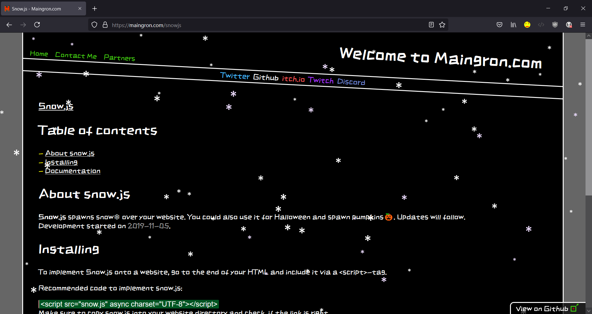

# Snow.js — lightweight JavaScript snow effect for websites

[](https://codeclimate.com/github/Maingron/snow.js/maintainability)

Snow.js is a small, dependency-free JavaScript library that renders a falling snow effect (and other seasonal particle-style effects) on any website using a single `<script>` tag.

Use it for Christmas snow, winter vibes, Halloween pumpkins/ghosts, New Year confetti-like motion, or custom characters/emojis.

## Table of contents
- [Features](#features)
- [Quick start](#quick-start)
- [Configuration](#configuration)
- [Presets](#presets)
- [Examples](#examples)
- [Accessibility](#accessibility)
- [Troubleshooting](#troubleshooting)
- [Screenshots](#screenshots)
- [Links](#links)

## Features
- Drop-in snow effect for plain HTML sites (no build step)
- Presets: `christmas`, `winter`, `halloween`, `newyear`, `butterfly`
- Fully configurable: density, opacity, sizes, colors, wind, gravity, jitter
- Respects `prefers-reduced-motion` (auto-disables when enabled)
- MIT licensed

## Quick start
1) Copy `snow.js` into your website folder.

2) Include it right before `</body>`:

```html
<script src="snow.js" async charset="UTF-8"></script>
```

That's it - Snow.js initializes itself on page load.

## Configuration
Snow.js is configured by editing the `config` object near the top of `snow.js`.

There is currently no public JS API (no exported function) - configuration is file-based.

### Basic settings
- `enable` (boolean): Enable/disable the effect. Default: `true`.
- `preset` (string): Preset name. Default: `"none"`.
- `snowChars` (array of strings): Characters used as flakes/particles. Default: `["*"]`.
- `snowOpacity` (number $0..1$): Opacity. Default: `0.75`.
- `maxSnow` (number): Maximum number of flakes. Default: `window.innerHeight / 8`.
- `jitterAmount` (number): Horizontal jitter strength. Default: `2`.
- `jitterProbability` (number $0..1$): Probability jitter applies each tick. Default: `0.8`.
- `windAmount` (number): Horizontal drift (positive = right). Default: `0.5`.
- `gravityAmount` (number): Vertical speed. Default: `3`.
- `gravityJitterAmount` (number): Random gravity variation amount. Default: `4`.
- `gravityJitterProbability` (number $0..1$): Probability gravity jitter applies each tick. Default: `0.5`.
- `overscanX` (number px): Spawn/teleport buffer on the left/right. Default: `100`.
- `initialYSpacing` (number px): Initial distribution of flakes on Y. Default: `-window.innerHeight - 200`.
- `offsetTop` (number px): Top teleport/spawn offset. Default: `-100`.
- `offsetBottom` (number px): Bottom teleport offset. Default: `100`.
- `snowSizes` (array of CSS sizes): Font sizes for flakes. Default: `["20px","25px","35px","40px"]`.
- `snowColors` (array of CSS colors): Colors for flakes. Default: `["#ccc","#fff","#edf"]`.
- `snowFont` (string, CSS font-family): Font used for flakes. Default: `"inherit"`.
- `hideSnowflakesOnPrint` (boolean): Hide snowflakes when printing the page. Default: `true`.

### Advanced / experimental settings
- `cssTransition` (number seconds): Applies a CSS `transition` on flakes. Default: `0`.
- `autoFixScriptTag` (boolean): Attempts to add `async` + `charset` to the `<script src="...snow.js">` tag automatically. Default: `false`.
- `maxDecimalLength` (number): Decimal precision used for positions. Default: `1`.
- `snowflakeTagName` (string): Tag name for flakes. Default: `"i"`.
- `snowflakeClassName` (string): Class name for flakes. Default: `"s"`.
- `targetFPS` (number): Should be set to `60`, maybe `30`. Don't change to a higher value! Affects snow speed. Note the actual framerate will match the user's monitor. Default: `60`.

Notes:
- The config includes `snowContainer`, but the current implementation appends flakes to `document.body` internally.
- Presets are applied by merging preset values into `config` when `preset !== "none"`.

## Presets
Set `config.preset` to one of:
- `none` (default)
- `christmas`
- `winter`
- `snowy1`
- `halloween`
- `newyear`
- `butterfly`

Presets override a subset of options (e.g., `snowChars`, gravity, colors, density). You can still tweak any values after choosing a preset.

## Examples
This repo includes a runnable example at `examples/example.html`.

To test locally, open the file in a browser, or serve the repo with any static server.

## Accessibility
Snow.js hides the effect when the user has enabled reduced motion:
- CSS: `@media (prefers-reduced-motion: reduce) { .<snowflakeClassName> { display: none; } }`
- JS: the script disables itself when `prefers-reduced-motion: reduce` matches.

Printing behavior:
- If `hideSnowflakesOnPrint` is enabled (default: `true`), snowflakes are hidden when printing the page (via print styles). This avoids cluttering printed pages with decorative particles.

## Troubleshooting
- **No snow appears**: confirm the script path is correct and that `config.enable` is `true`.
- **Nothing shows on some devices**: check whether `prefers-reduced-motion` is enabled.
- **Characters look wrong**: set `snowFont` to a font that supports your chosen emojis/symbols.

## Screenshots



## Links
- Project website: https://maingron.com/snowjs
- GitHub repo: https://github.com/Maingron/snow.js
- Wiki (legacy docs): https://github.com/Maingron/snow.js/wiki
